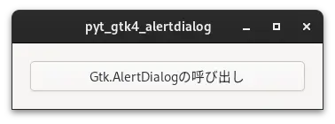
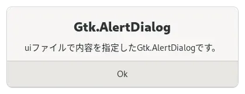

# 01_call_alertdialog

[戻る](../README.md)

<br>

## 内容 

ボタンを押すと、OKボタンを持つGtk.AlertDialogを表示するプログラム。

 

<br>

### uiファイルで定義したGtk.AlertDialogを呼び出す。

```
    alertdialog = Gtk.Template.Child()

    …

    @Gtk.Template.Callback()
    def on_button_clicked(self, button):
        self.alertdialog.show(self)
```

## 参考にしたHP

[戻る](../README.md)
