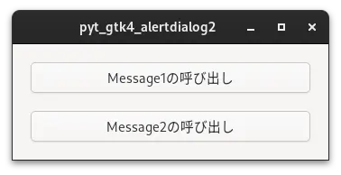
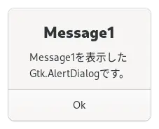
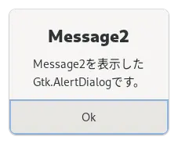

# 02_set_message

[戻る](../README.md)

<br>

## 内容 

呼び出し時にメッセージの変更が可能な「Ok」ボタンを持ったGtk.AlertDilaogを表示するプログラム

  

<br>

### Python側でGtk.AlertDialogのmessageやdetailを変更する。

```
    @Gtk.Template.Callback()
    def on_button1_clicked(self, button):
        self.alertdialog.set_message('Message1')
        self.alertdialog.set_detail('Message1を表示した\nGtk.AlertDialogです。')
        self.alertdialog.show(self)
```

<br>

## 参考にしたHP

[戻る](../README.md)
