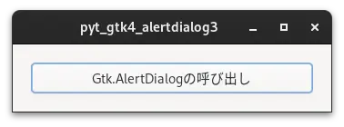
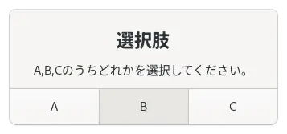
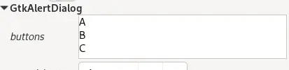

# 03_buttons

[戻る](../README.md)

<br>

## 内容 

複数の選択肢をもったGtk.AlertDialogを表示するプログラム

 

<br>

### uiファイルでGtk.AlertDialogに複数の選択肢を指定する

項目buttonsに選択肢を１つずつ改行を加えて記入する。

 

<br>

### 複数の選択肢を持つGtk.AlertDialogを表示するプログラム

```
    alertdialog = Gtk.Template.Child()

    …

    @Gtk.Template.Callback()
    def on_button_clicked(self, button):
        self.alertdialog.choose(self, None, self.alert_choose)

```

<br>

###  複数の選択肢を持つGtk.AlertDialogの選択肢を押した場合の処理

```
    def alert_choose(self, alertdialog, result):

        num = alertdialog.choose_finish(result)
        match num:
            case 0:
                print('「A」もしくはEnterキーが押されました。')
            case 1:
                print('「B」が押されました。')
            case 2:
                print('「C」が押されました。')
```

<br>

## 参考にしたHP

[戻る](../README.md)
